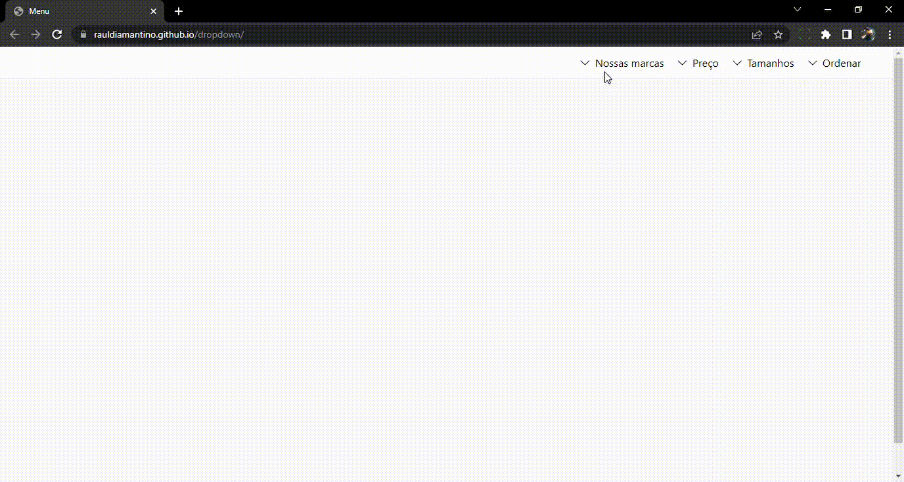

# Dropdown horizontal com CSS

O objetivo deste projeto é treinar a criação de soluções, utilizando a menor quantidade possível de código JavaScript.

  

    Tecnologias utilizadas
  

  <ul>
    <li>HTML5</li>
    <li>ES6 JavaScript</li>
    <li>Sass v1.57.1</li>
    <li>TailwindCss v2.2.19</li>
  </ul>

  

    Demonstração
  

  

  

    Acessar projeto
  

    https://rauldiamantino.github.io/dropdown/

